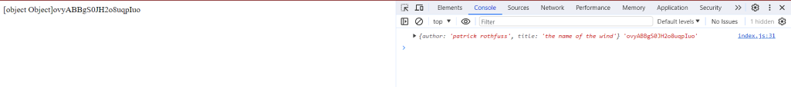

# Entry 2: Learning Tools
##### 12/17/23

I am currently on stage 2 on Engineering Design Process, which is researching the tool. I continued watching [NetNinja’s Firebase Tutorial](https://www.youtube.com/watch?v=9zdvmgGsww0&list=PL4cUxeGkcC9jERUGvbudErNCeSZHWUVlb) and so far I have learned how to play around with the database such as fetching data from the database, adding and deleting documents on and not on the [website](console.firebase.google.com), etc.
With that knowledge, I decided to try to make some function that I will definitely need to make in my freedom project. So I worked on functions including fetching the data and displaying them to the HTML webpage and deleting documents without document ID.
Firstly, I thought putting the data I fetched from the database on the HTML webpage would be easy but I was wrong. I used
 `console.log(snapshot.docs[0].data(), snapshot.docs[0].id) document.write(snapshot.docs[0].data(), snapshot.docs[0].id)` and it displayed this result:



After a little bit of confusion, I decided to look up this problem. Although I didn't get answers directly for this problem, I found some hints that are related to this problem, which is JSON Object. By looking into the documentation of JSON Objects, I realized that I will need to use .author for it to display a specific data in that JSON. Which also explained how the ID got displayed in the HTML webpage but not the others.

Now that the user is able to see the data, I have to somehow make it so that the user doesn't need the document ID to delete a certain document. To do that, I thought that it would be best for the user to type in the author and the title of that specific document to delete and then the computer will find the user input to every data in the database to get the ID of that document so the computer can delete that document.

What I did:
```js
// delete document
const deleteBook = document.querySelector('.delete')
deleteBook.addEventListener('submit', function(event) {
  event.preventDefault()
  let length = books.length;
    for(let i = 0; i < books.length; i++){ // iterate through the database to match the user input
      if (deleteBook.author.value == books[i].author && deleteBook.title.value == books[i].title) {
        deleteDoc(doc(db, 'book', books[i].id))
      }
  }
  deleteBook.reset() //the input will get back to it's default value after the user click submit.
}
```
Then to make sure the code doesn't crash, I created validation using the try statement. Basically what I am trying to do is that if the user insert a data that doesn't match, the user will get an error message saying "Invalid Input".


What I did:

```js
// delete document
const deleteBook = document.querySelector('.delete')
deleteBook.addEventListener('submit', function(event) {
  event.preventDefault()
  let length = books.length;
  try {
    for(let i = 0; i < books.length; i++){ // iterate through the database to match the user input
      if (deleteBook.author.value == books[i].author && deleteBook.title.value == books[i].title) {
        deleteDoc(doc(db, 'book', books[i].id))
        document.getElementById("error").innerHTML = ""; //clearing the error message if user input works
      } else{
        throw "invalid input";
      }
    }
  }
  catch(err){
    document.getElementById("error").innerHTML = err
  }
  deleteBook.reset() // the input will get back to it's default value after the user click submit.
})
```

Throughout this tinkering, I have practice on How to Google and Problem Decomposition. I break up the task of "The user is able to delete documents without ID" into three parts which are the user is able to see the data, matching the user input with the data in the database, and user input validation. When I have trouble, I google for the problems I am getting and look into documentation on how it works.

[Previous](entry01.md) | [Next](entry03.md)

[Home](../README.md)